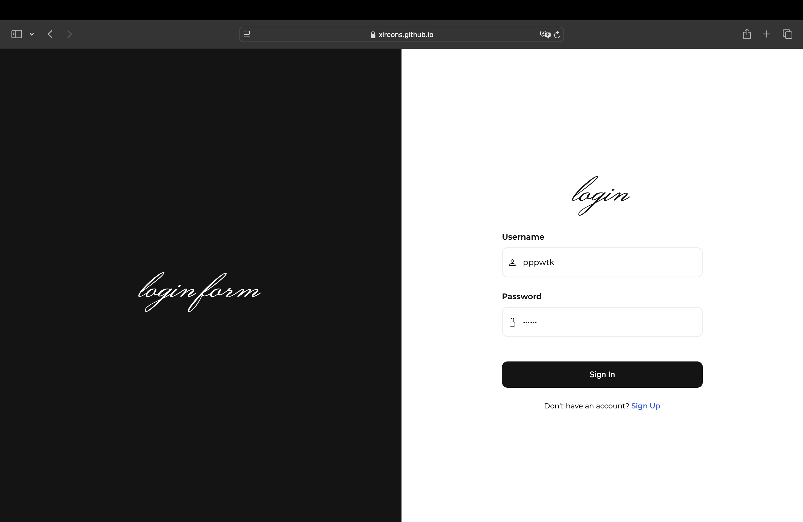
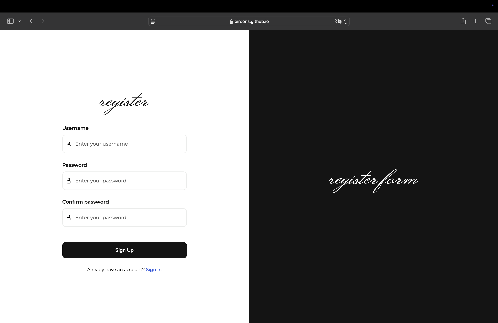

# Responsive Authentication Form Demo
This repository contains a demo of a simple, responsive authentication interface featuring a login and registration form. Built with HTML, CSS, and JavaScript

## Features
Login Form: Username and password input with required field validation.
Registration Form: Username, password, and confirm password fields with password matching validation.
Responsive Design: Split layout with a decorative text panel and form panel.
Lightweight: Minimal dependencies, using custom CSS and vanilla JavaScript.

## Demo


```bash
https://xircons.github.io/responsive-authen-form-demo/login.html
```

Linux / macOS
```bash
sudo git clone https://github.com/xircons/responsive-authen-form-demo
```
Windows
```bash
git clone https://github.com/xircons/responsive-authen-form-demo
```

# Full Version (Premium)
Want more features? The premium version includes:

- Dark/Light mode toggle
- Social login integration (Google & Apple)
- Enhanced form validation with real-time feedback
- Responsive design across all screen sizes
- Additional UI enhancements
- Purchase the full version on UI8 for Linux and macOS:

Buy Now on UI8

## License
This demo is licensed under the MIT License.

## Contact
For questions or support, reach out via GitHub Issues or email me at wuttikan_s@cmu.ac.th.
